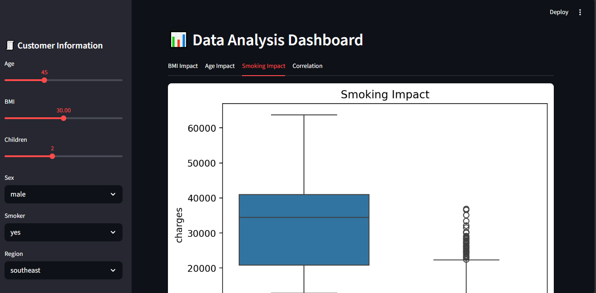
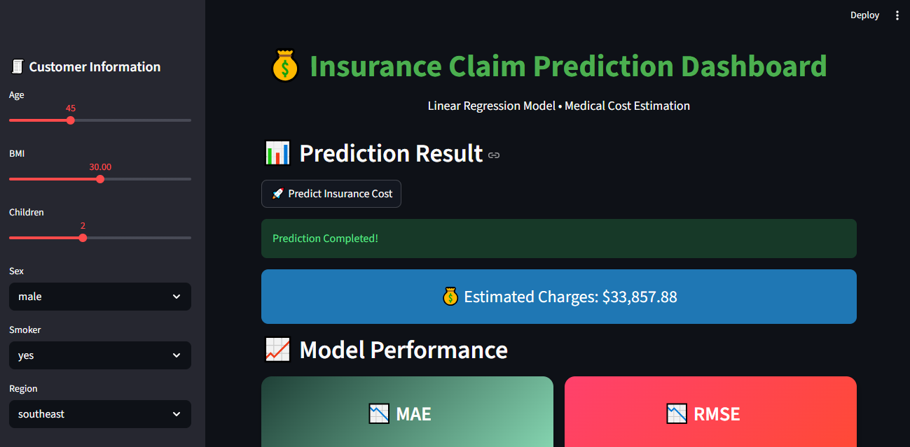

# 💰 Insurance Claim Prediction (Linear Regression)


---

## 📌 Objective

To predict medical insurance claim charges based on personal attributes such as age, BMI, smoking status, and region using a **Linear Regression model**, and provide an interactive Streamlit dashboard for visualization and prediction.

---

## 📁 Project Structure

```text
insurance-claim-prediction/
│
├── data/
│   └── insurance.csv
│
├── src/
│   ├── app.py
│   └── model.py
│
├── requirements.txt
└── README.md
```

---

## 🌐 Live Deployment

🚀 The application is deployed on Streamlit Cloud:

https://insurance-claim-prediction-hjne3ngt7kim52ym9gxxb4.streamlit.app/
---

## 📊 Dataset

Medical Cost Personal Dataset includes:

* Age
* Sex
* BMI
* Number of children
* Smoking status
* Region
* Insurance charges (target variable)

---

## ⚙️ Approach

* Data cleaning and preprocessing
* Encoding categorical variables (sex, smoker, region)
* Exploratory Data Analysis (EDA)
* Feature correlation analysis
* Model training using Linear Regression
* Model evaluation using MAE and RMSE
* Interactive dashboard using Streamlit

---

## 🧠 Workflow

User Input → Preprocessing → Linear Regression Model → Prediction → Visualization

---

## 📈 Features of Dashboard

* Sidebar user input form
* Real-time insurance cost prediction
* BMI vs charges visualization
* Age vs charges visualization
* Smoking impact analysis
* Feature correlation heatmap
* Model evaluation metrics (MAE, RMSE)

---

## 📊 Model Evaluation

* **MAE (Mean Absolute Error):** measures average prediction error
* **RMSE (Root Mean Squared Error):** penalizes large errors more heavily

---

## 🤖 Results

* Linear Regression model successfully predicts insurance charges
* Smoking status has the strongest impact on cost
* BMI shows moderate positive correlation with charges
* Age gradually increases insurance cost

---

## 📸 Screenshots

### Dashboard View



### Prediction Result



---

## 🧠 Model Explanation

The Linear Regression model learns a linear relationship between input features and insurance charges:

* Smoking → Strong positive impact
* BMI → Moderate impact
* Age → Gradual increase
* Region → Minor variation

---

## ⚙️ Tech Stack

* Python
* Streamlit
* Pandas
* NumPy
* Matplotlib
* Seaborn
* Scikit-learn

---

## 🚀 Run Locally

```bash
pip install -r requirements.txt
streamlit run src/app.py
```

---

## 👨‍💻 Author

Muhammad Shayan Ahmed

---

## 📌 Key Insight

Smoking and BMI are the strongest predictors of insurance charges in this dataset, significantly increasing medical costs.
